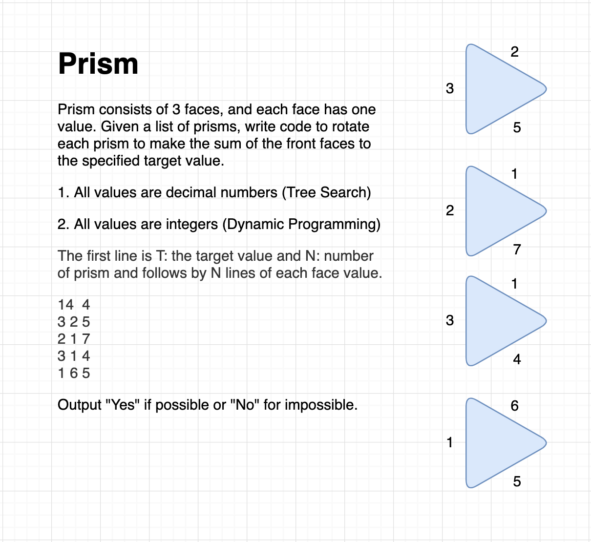

# Homework
Homework for Java Bootcamp

ปกติที่ CODESTAR จะไม่มีแบบฝึกหัดหรือการบ้านให้กลับไปทำนะครับ เรียนในห้องให้เข้าใจแล้วจบเลย 
ไม่ต้องเสียเวลาไปปวดหัวต่อที่บ้าน แต่บางครั้งช่วงวันหยุดจะมีการบ้านให้กลับไปทำเหมือนกัน 
ที่สำคัญการบ้านที่ CODESTAR ไม่มีทางไป Search หาคำตอบจากไหนได้แน่นอนครับ 
เรียนที่นี่แค่ 7 วันต้องทำการบ้านนี้ได้ครับ 
ดูคอร์สเรียนได้ที่นี่ https://codestar.work/register

การบ้านเดือนนี้มีทั้ง Depth-First Search และ Dynamic Programming
ใครมีเพื่อนทำได้ส่งใบสมัครงานมาได้เลยครับ 
ไม่ต้องมาเรียนให้เสียเวลา support@codestar.work

https://github.com/kookiatsuetrong/homework

## October 2019

### 1. Binary Tree
- ตัวอย่าง: ให้เขียน Code เพื่อรับ Binary Tree เข้ามาแล้วนับจำนวน Leaf
```java

int countLeaf(Element e) {
  if (e == null) return 0;
  if (e.left == null && e.right == null) return 1;
  return countLeaf(e.left) + countLeaf(e.right);
}

```

- ให้เขียนโค้ดเพื่อรับ Binary Tree เข้ามา แล้วหาค่าใน Leaf ที่สูงที่สุด ตัวอย่างในภาพได้ผลลัพธ์คือ 9

- ให้เขียนโค้ดเพื่อรับ Binary Tree เข้ามา แล้วเอาค่าใน Leaf มารวมกัน ตัวอย่างในภาพได้ผลลัพธ์คือ 23

- ให้เขียนโค้ดเพื่อรับ Binary Tree เข้ามา แล้วหาค่าที่มากที่สุดของแต่ละชั้น ตัวอย่างในภาพได้ผลลัพธ์คือ 3, 8, 5, 9, 1

- ให้เขียนโค้ดเพื่อรับ Binary Tree เข้ามา แล้วหาผลรวมของแต่ละชั้น ตัวอย่างในภาพได้ผลลัพธ์คือ 3, 15, 14, 19, 1

```java
class Element {
  int value;
  Element left;
  Element right;
}
```


## September 2019

### 0. Container
ตัวอย่างในห้องเรียน มีสินค้า N กล่อง 
แต่ละกล่องมีมูลค่าและน้ำหนัก 
ให้เลือกสินค้าใส่ตู้ Container ที่รับน้ำหนักได้จำกัด
โดยให้มีมูลค่าสินค้ามากที่สุด
```
14 7
200 4
500 6
300 5
800 9
700 7
600 6
100 1
```
นั่นคือมีตู้ Container บรรทุกได้ไม่เกิน 14 ตัน มีกล่องสินค้า 7 กล่อง 
กล่องแรกมีมูลค่า 200 น้ำหนัก 4 ตัน
และกล่องสุดท้ายมีมูลค่า 100 น้ำหนัก 1 ตัน

1. ใช้วิธี Greedy
2. เมื่อน้ำหนักเป็นเลขทศนิยม ใช้วิธี Branch And Bound
3. เมื่อน้ำหนักเป็นจำนวนเต็ม ใช้วิธี Dynamic Programming


### 1. Prism

Prism มี 3 หน้า แต่ละหน้ามีตัวเลขกำกับไว้
เมื่อหมุน Prism จะมีตัวเลขถัดไปมาแทน เช่น [3,2,5] เมื่อหมุนจะได้ [5,3,2]
และหมุนอีกทีได้ [2,5,3] กำหนดตัวเลข T คือเป้าหมายที่ต้องการ
ให้เขียนโค้ดเพื่อหาว่าเป็นไปได้หรือไม่ ที่จะหมุน Prism จำนวน N ชิ้น
แล้วให้ผลรวมตัวกลางเท่ากับตัวเลข T



1. ตัวเลขแต่ละหน้าเป็นจำนวนทศนิยม (Depth-First Search) 
2. ตัวเลขแต่ละหน้าเป็นจำนวนเต็ม   (Dynamic Programming)

กำหนดให้มีข้อมูลคือ T, N และ ตามด้วยข้อมูลแต่ละหน้าของ Prism
```
14 4
3 2 5
2 1 7
3 1 4
1 6 5
```
ข้อมูลนี้มีเป้าหมายคือ 14 และมี Prism จำนวน 4 ชิ้น
สามารถหมุน Prism ให้ผลรวมเป็นค่าที่ต้องการได้เช่น
```
5 3 2
2 1 7
1 4 3
1 6 5
```
ผลรวมตรงกลางคือ 3 + 1 + 4 + 6 = 14 พิมพ์คำตอบ Yes ถ้าเป็นไปได้

หรือ
```
11 3
1 3 5
2 4 6
7 3 1
```
ไม่มีทางหมุน Prism ทั้ง 3 ตัว ให้ได้ผลรวมเป็น 11 ได้ พิมพ์คำตอบ No ถ้าเป็นไปไม่ได้


### 2. Domino Prism

Prism มี 3 หน้า ในแต่ละหน้ามีตัวเลข 2 ตัว
เมื่อหมุน Prism จะมีตัวเลขจากหน้าถัดไปขึ้นมาแทน

```
1 2                       2 3
3 1   ====> Rotate ====>  1 2
2 3                       3 1
```


ข้อมูลมีจำนวนของ Prism และ รายละเอียดของ Prism แต่ละตัว
```
5
3 1    3 2    1 2    3 1    1 4
2 3    1 4    4 2    2 1    3 4
1 2    3 4    2 1    1 3    3 2
```
จากข้อมูลข้างบน เมื่อหมุน Prism ตัวแรกและตัวสุดท้าย แถวกลางจากเชื่อมต่อกันได้
```
1 2    3 2    1 2    3 1    3 2
3 1    1 4    4 2    2 1    1 4  ====> Middle layer are connected
2 3    3 4    2 1    1 3    3 4
```

1. ให้เขียนโค้ดเพื่อหาว่า Prism ที่กำหนดให้สามารถหมุนมา
เพื่อให้ตรงกลางเชื่อมต่อกันได้เหมือน Domino หรือไม่
โดยไม่ต้องสลับที่ Prism ใช้ลำดับเดิมที่ให้มา

2. ให้เขียนโค้ดหาว่าถ้าหยิบและหมุน Prism ที่ให้มาวางต่อกัน
เพื่อให้ตรงกลางต่อกันแบบ Domino ได้หรือไม่
โดยที่ Prism ที่มาต่อกันจะมีลำดับก่อนหลังยังไงก็ได้

## August 2019

### Divide & Conquer in Binary Tree


จาก Binary Tree ที่จะส่งเข้าไปใน Method ซึ่งใน Binary Tree อาจจะมีข้อมูลนับล้านตัว 
ให้เขียนโค้ดหาคำตอบดังนี้

- หา Leaf ที่มีค่ามากที่สุด ตัวอย่างในภาพคือ 9

- ค่าผลรวมของค่าใน Leaf ตัวอย่างในภาพคือ 5 + 9 + 1 + 5 + 1 + 2 = 23

- ค่าที่มากที่สุดจาก Root ไปยัง Leaf ตัวอย่างในภาพคือ 3 + 7 + 2 + 9 = 21

- ให้พิมพ์ผลรวมของแต่ละชั้น ตัวอย่างในภาพคือ 3, 15, 14, 19, 1

ตัวอย่างการหาค่าทั้งหมดใน Tree
```
int getSum(Node c) {
	if (c == null) return 0;
	return c.value + getSum(c.left) + getSum(c.right);
}
```

### ม้าหมุน
(Breadth-First Search, Depth-First Search, Iterative Deepening for NP-Complete Problem)

ม้าหมุนแต่ละตัวจะมี 4 ขา แต่ละขามีสีหรือตัวเลขกำกับไว้ ม้าหมุนสามารถหมุนได้ทีละ 90 องศา 
ให้เขียนโค้ดเพื่อหมุนให้ขาที่ติดกัน มีสีหรือตัวเลขเดียวกัน ให้พิมพ์จำนวนการหมุนที่น้อยที่สุดออกมาถ้าเป็นไปได้ หรือพิมพ์ Impossible ถ้าเป็นไปไม่ได้


ตัวอย่างมีม้าหมุน 6 ตัว แบ่งเป็น 2 x 3 ตัว แต่ละตัวมีข้อมูลตามเข็มนาฬิกาตามภาพข้างบน 
ม้าหมุนตัวแรกมีค่า 1 2 3 4
```
2 3
1 2 3 4
5 3 4 2
3 2 1 5
4 2 5 3
2 4 3 1
4 3 5 2
```

ตัวอย่างผลลัพธ์จากภาพคือหมุน 4 ครั้ง

### Square Domino
(Breadth-First Search, Depth-First Search)

Square Domino แต่ละตัวมี 4 ช่อง ซึ่งสามารถหมุนได้ครั้งละ 90 องศา เพื่อเอาด้านที่เหมือนกันมาต่อกัน
ดังภาพ


ตัวอย่างข้อมูลมี Square Domino 6 ตัว แต่ละตัวมีข้อมูลเรียงตามเข็มนาฬิกา ตัวแรกคือ 5 1 2 4

```
6
5 1 2 4
1 2 3 4
2 1 5 3
2 1 5 3
5 3 4 2
5 1 2 3
```

ให้เขียนโค้ดหาว่าสามารถวาง Square Domino ให้เรียงเป็นเส้นตรงเดียวกันได้หรือไม่ 
โดยไม่จำเป็นต้องเรียงตามลำดับ


## Backup Homework

เลื่อยไฟฟ้าในโรงงานจะทำงานได้ดี ถ้าท่อนซุงที่เข้ามาเรียงลำดับจากน้อยไปมาก
ให้เขียนโค้ดเพื่อหาว่า จะดึงท่อนซุงออกไปกี่อันให้น้อยที่สุด 
เพื่อให้เลื่อยไฟฟ้าทำงานได้ดี

```
double[] log = { 2.5, 1.7, 2.3, 2.4 }; 
// เอาอันแรกออกไป จะเหลือข้อมูลที่เรียงลำดับกัน
```

```
double[] log = { 1.2, 1.1, 1.5, 2.0, 1.7, 1.8 };
// ทำได้หลายแบบ เช่น เอา 1.1 กับ 2.0 ออกไปจะเหลือ 4 ท่อน
```
