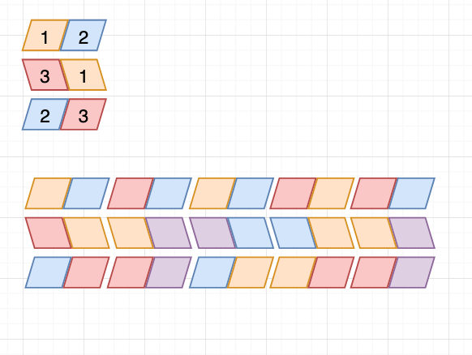
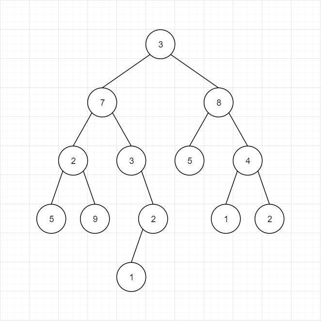
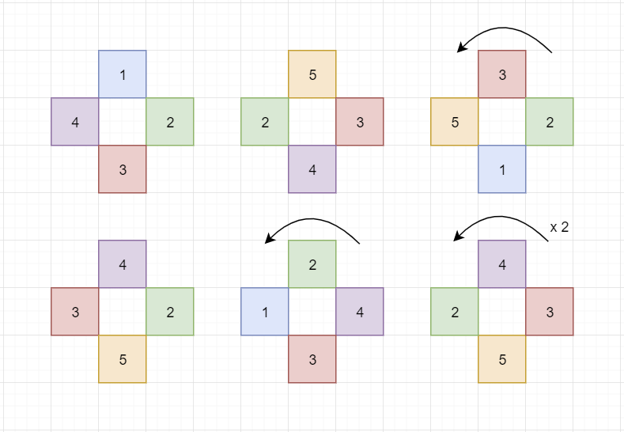

# Homework
Homework for Java Bootcamp

ปกติที่ CODESTAR จะไม่มีแบบฝึกหัดหรือการบ้านให้กลับไปทำนะครับ เรียนในห้องให้เข้าใจแล้วจบเลย 
ไม่ต้องเสียเวลาไปปวดหัวต่อที่บ้าน แต่บางครั้งช่วงวันหยุดจะมีการบ้านให้กลับไปทำเหมือนกัน 
ที่สำคัญการบ้านที่ CODESTAR ไม่มีทางไป Search หาคำตอบจาก Google ได้แน่นอนครับ 
ลอกใครไม่ได้ต้องคิดเอง เรียนที่นี่แค่ 7 วันต้องทำการบ้านนี้ได้ครับ 
ดูคอร์สเรียนได้ที่นี่ https://codestar.work/register

มีน้องคนนึงจบบริหารธุรกิจมาเรียนแล้วบอกว่า 
เรื่อง Depth-First Search, Breadth-First Search 
ยังง่ายกว่า Dynamic Programming ด้วยซ้ำ ซึ่งก็คงจะจริงครับ 
ใครมีเพื่อนทำได้ส่งใบสมัครงานมาได้เลยครับ 
ไม่ต้องมาเรียนให้เสียเวลา support@codestar.work

https://github.com/kookiatsuetrong/homework


### Prism

กำหนดให้มี Prism รูปสามเหลี่ยมที่มี 3 หน้า ในแต่ละหน้ามีตัวเลข 2 ตัว
Prism นี้จะหมุนได้ เช่นถ้ามี Prism เหมือนในรูปด้านซ้าย 
และเมื่อหมุน 1 ครั้งจะได้ Prism เหมือนในรูปด้านขวา

```
1 2                         2 3
3 1     ====> Rotate ====>  1 2
2 3                         3 1
```



1. ให้เขียนโค้ดเพื่อหาว่า Prism ที่กำหนดให้สามารถหมุนมา
เพื่อให้ตรงกลางเชื่อมต่อกันได้เหมือน Domino หรือไม่
โดยไม่ต้องสลับที่ Prism ใช้ลำดับเดิมที่ให้มา

```
1 2    3 2    1 2    3 1    3 2
3 1    1 4    4 2    2 1    1 4  ====> Middle layer are connected
2 3    3 4    2 1    1 3    3 4
```

2. ให้เขียนโค้ดหาว่าถ้าหยิบ Prism แต่ละตัวมาวางต่อกัน
และพยายามหมุน Prism เหล่านั้น เพื่อให้ตรงกลางต่อกันแบบ Domino ได้หรือไม่


### Divide & Conquer in Binary Tree



จาก Binary Tree ที่จะส่งเข้าไปใน Method ซึ่งใน Binary Tree อาจจะมีข้อมูลนับล้านตัว 
ให้เขียนโค้ดหาคำตอบดังนี้

- หา Leaf ที่มีค่ามากที่สุด ตัวอย่างในภาพคือ 9

- ค่าผลรวมของค่าใน Leaf ตัวอย่างในภาพคือ 5 + 9 + 1 + 5 + 1 + 2 = 23

- ค่าที่มากที่สุดจาก Root ไปยัง Leaf ตัวอย่างในภาพคือ 3 + 7 + 2 + 9 = 21

- ให้พิมพ์ผลรวมของแต่ละชั้น ตัวอย่างในภาพคือ 3, 15, 14, 19, 1

ตัวอย่างการหาค่าทั้งหมดใน Tree
```
int getSum(Node c) {
	if (c == null) return 0;
	return c.value + getSum(c.left) + getSum(c.right);
}
```

### ม้าหมุน
(Breadth-First Search, Depth-First Search, Iterative Deepening for NP-Complete Problem)

ม้าหมุนแต่ละตัวจะมี 4 ขา แต่ละขามีสีหรือตัวเลขกำกับไว้ ม้าหมุนสามารถหมุนได้ทีละ 90 องศา 
ให้เขียนโค้ดเพื่อหมุนให้ขาที่ติดกัน มีสีหรือตัวเลขเดียวกัน ให้พิมพ์จำนวนการหมุนที่น้อยที่สุดออกมาถ้าเป็นไปได้ หรือพิมพ์ Impossible ถ้าเป็นไปไม่ได้



ตัวอย่างมีม้าหมุน 6 ตัว แบ่งเป็น 2 x 3 ตัว แต่ละตัวมีข้อมูลตามเข็มนาฬิกาตามภาพข้างบน 
ม้าหมุนตัวแรกมีค่า 1 2 3 4
```
2 3
1 2 3 4
5 3 4 2
3 2 1 5
4 2 5 3
2 4 3 1
4 3 5 2
```

ตัวอย่างผลลัพธ์จากภาพคือหมุน 4 ครั้ง

### Square Domino
(Breadth-First Search, Depth-First Search)

Square Domino แต่ละตัวมี 4 ช่อง ซึ่งสามารถหมุนได้ครั้งละ 90 องศา เพื่อเอาด้านที่เหมือนกันมาต่อกัน
ดังภาพ


ตัวอย่างข้อมูลมี Square Domino 6 ตัว แต่ละตัวมีข้อมูลเรียงตามเข็มนาฬิกา ตัวแรกคือ 5 1 2 4

```
6
5 1 2 4
1 2 3 4
2 1 5 3
2 1 5 3
5 3 4 2
5 1 2 3
```

ให้เขียนโค้ดหาว่าสามารถวาง Square Domino ให้เรียงเป็นเส้นตรงเดียวกันได้หรือไม่ 
โดยไม่จำเป็นต้องเรียงตามลำดับ
